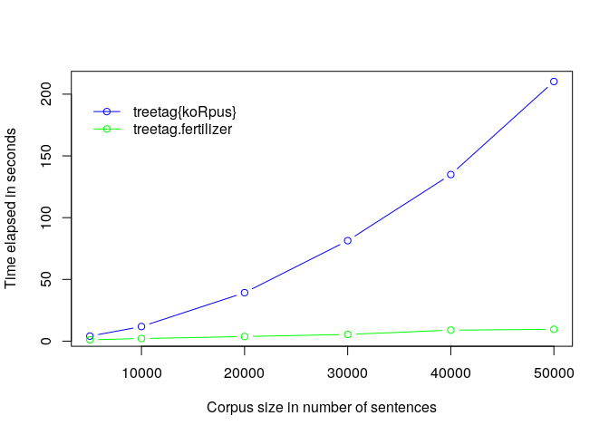

R function *treetag.fertilizer*
================

Description
-----------

The R function *treetag.fertilizer* calls a local installation of *TreeTagger* (Schmid, 1994) and identifies sentences in the parsed corpus. The output is a dataframe with tokens in rows and annotations in columns.

Usage
-----

treetag.fertilizer(pathToTreetagger, pathToCorpus, language, sentence\_delim = c("!", "?", ".", ":", ";"))

Arguments
---------

<table>
<colgroup>
<col width="9%" />
<col width="90%" />
</colgroup>
<tbody>
<tr class="odd">
<td>pathToTreeTagger</td>
<td>Character string specifying the path to the local installation of TreeTagger, e.g., &quot;/home/user/TreeTagger/&quot;</td>
</tr>
<tr class="even">
<td>pathToCorpus</td>
<td>Character string specifying the path to the corpus files, e.g., &quot;./data/&quot;</td>
</tr>
<tr class="odd">
<td>language</td>
<td>Character string naming the language of the corpus, e.g., &quot;english&quot; or &quot;german&quot;</td>
</tr>
<tr class="even">
<td>sentence_delim</td>
<td>Character vector with tokens specifying sentence delimiters</td>
</tr>
</tbody>
</table>

Details
-------

Note that the function calls *TreeTagger* with default configuration and has no options to change that. The language argument specifies the language-specific tagging script that *TreeTagger* uses to parse the corpus. The language label should match the last part of the respective file name (e.g., *tree-tagger-german* for parsing German-language data). The function uses !?.:; as sentence delimiters by default. Enter a character vector with different elements to change sentence delimiters.

Comparison to *treetag* in the *koRpus* package
-----------------------------------------------

The function is similar to the function *treetag* in the *koRpus* package (Michalke, 2018), however, much faster. *TreeTagger* itself is very quick but sentence identification with *treetag* is slow and slows down with increasing corpus size. *treetag.fertilizer* speeds up sentence identification and is much less affected by corpus size (see Figure below) while using the most simplistic approach you have ever seen (see R code below).



R code
------

``` r
treetag.fertilizer<-function(pathToTreeTagger, pathToCorpus, language, sentence_delim = c("!", "?", ".", ":", ";")){
  
  # path to language-specific treetagger executable
  treetagger<-paste(pathToTreeTagger, "cmd/", "tree-tagger-", language, sep = "") 
  
  # generate system command
  systemCmd<-paste(treetagger, pathToCorpus) 
  
  # launch treetagger 
  corpus<-as.data.frame(do.call(rbind, strsplit(system(systemCmd, intern = TRUE), "\t")), stringsAsFactors = FALSE) 
  
  # set column names
  colnames(corpus)<-c("TOKEN", "POS", "LEMMA") 
  
  # find position of sentence boundaries
  x<-which(corpus$TOKEN %in% sentence_delim) 
  
  # calculate length of each sentence
  y<-x[-length(x)] 
  y<-append(0,y)
  
  # length of each sentence
  z<-x-y
  
  # produce vector of sequences of numbers for each sentence length
  vc<-rep(1:length(z), z) 
  
  # assign vector to tagged corpus
  corpus$SENTENCE<-vc 
  
  return(corpus)
}
```

References
----------

Michalke, M. (2018). koRpus: An R Package for Text Analysis. Available online at <https://cran.r-project.org/web/packages/koRpus/index.html>, February 22, 2020. Schmid, H. (1994). Probabilistic Part-of-Speech Tagging Using Decision Trees. In *Proceedings of International Conference on New Methods in Language Processing*. Manchester, England. Available online at <http://www.cis.uni-muenchen.de/~schmid/tools/TreeTagger/>, February 22, 2020.

**Author** Daniel Jach<br> **Contact** danieljach@protonmail.com<br> **Published** February 2020
